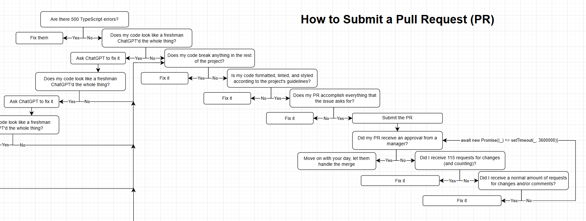

# SITHS Regents Prep App

Don't fail your regents! If you do... don't blame us.

Built by SITHS, for SITHS.

# Getting Started

Thanks for completely voluntarily contributing to the SITHS Regents Prep App!

> \[!TIP]\
> Install the recommended [VSCode extensions](./.vscode/extensions.json).
>
> ESLint - Shows ESLint in the editor without needing to run the CLI command
>
> Prettier - Formats your code without needing to run the CLI command

## 🚀 Project Setup

> \[!WARNING]\
> If you do not follow these steps and complain about the project not working, expect a lawsuit within 3-5 business days.

1. Ensure Node.js is installed on your machine

2. Clone the repository

3. Create a `.env` file in the root of the project

> \[!IMPORTANT]\
> Make sure you prepend a protocol `(http/https)` and append a `/`

```sh
NUXT_PUBLIC_BACKEND=http://127.0.0.1:8000/
```

4. Install dependencies and run locally

```sh
npm install
npm run dev
```

> \[!TIP]\
> You can expose localhost to your network by using `npm run dev -- --host`.
>
> This allows you to open the site via another device, such as your phone.

## Pull Requests

> \[!CAUTION]\
> Creating a bad PR may result in moderate to significant public humiliation.

When submitting a Pull Request, refer to the following flowchart:


